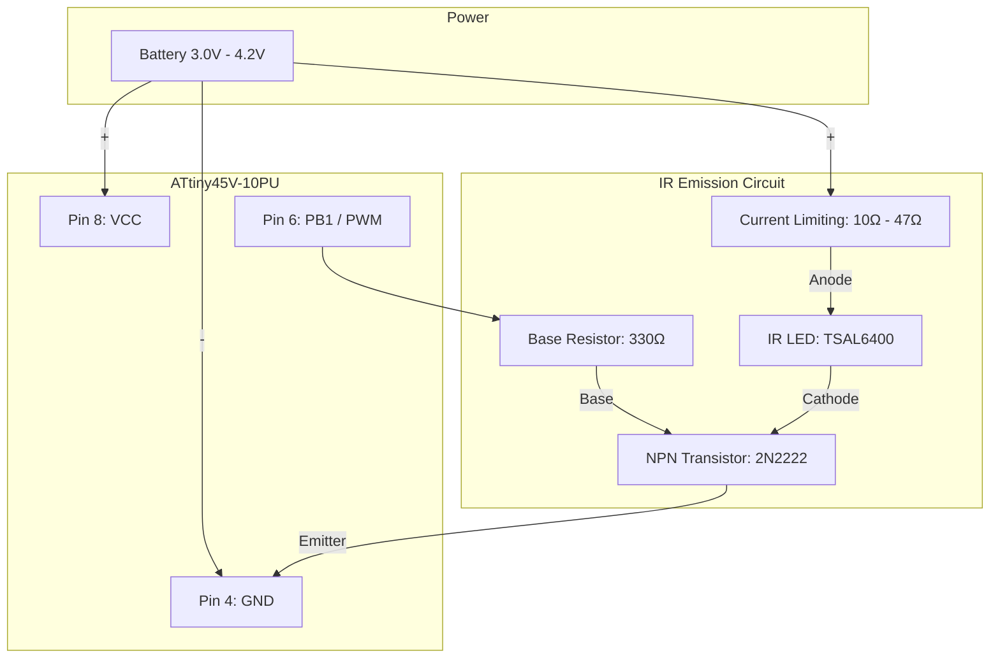
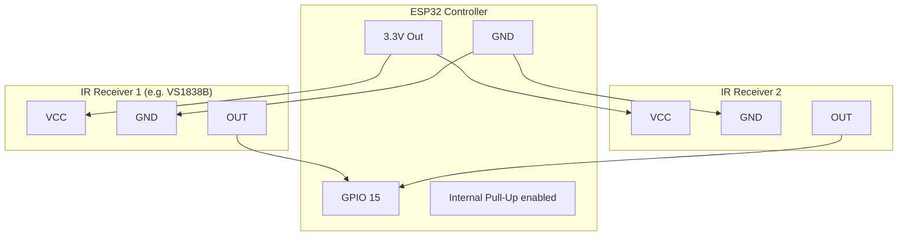
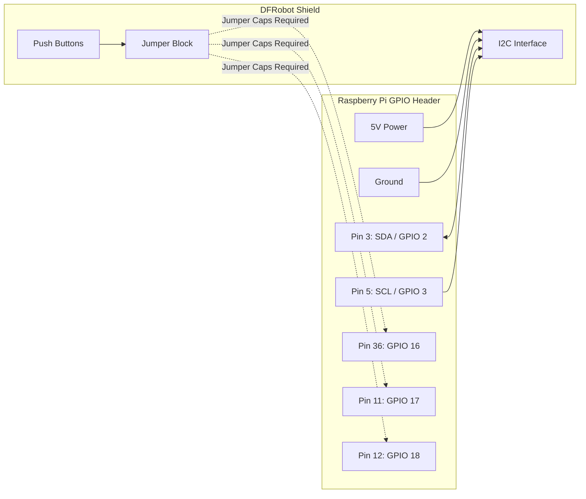

# Wiring Diagrams

Below are the logical wiring diagrams for the custom hardware components in the LapCounter Pro system.

## Droid Transponder (ATtiny45)

The transponder flashes a unique 38kHz IR signal identifying the droid. It is highly recommended to drive the high-power TSAL6400 IR LED using an NPN transistor rather than connecting it directly to the ATtiny pin.

## Sensor Bar (ESP32)

The sensor bar receives the IR signals. You can wire multiple IR receivers in parallel (daisy-chain) to a single GPIO pin to widen the detection area of the finish line.

*Note: For maximum reliability when daisy-chaining many IR receivers, place a diode (like 1N4148) on each OUT pin pointing towards the sensor, and add a single 10k pull-up resistor from GPIO 15 to 3.3V on the ESP32.*

## LCD Display (DFRobot DFR0514)

The DFRobot I2C 16x2 RGB LCD Keypad Shield is a HAT that sits directly on top of the Raspberry Pi.

